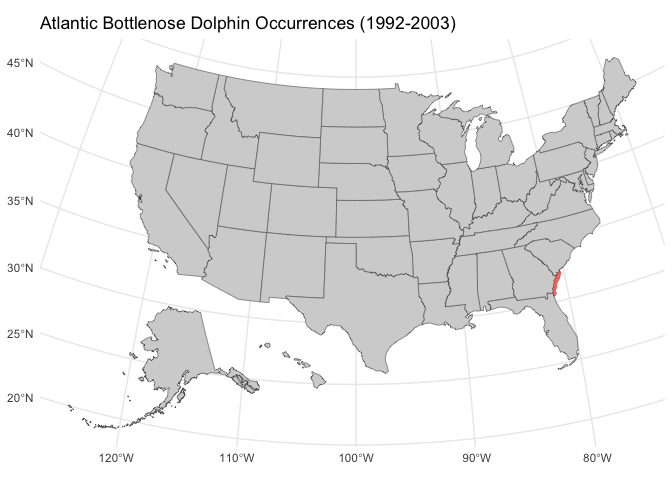

README
================
2025-02-24

``` r
options(repos = c(CRAN = "https://cran.rstudio.com/"))
```

``` r
library(tidyverse)
```

    ## ── Attaching core tidyverse packages ──────────────────────── tidyverse 2.0.0 ──
    ## ✔ dplyr     1.1.4     ✔ readr     2.1.5
    ## ✔ forcats   1.0.0     ✔ stringr   1.5.1
    ## ✔ ggplot2   3.5.1     ✔ tibble    3.2.1
    ## ✔ lubridate 1.9.4     ✔ tidyr     1.3.1
    ## ✔ purrr     1.0.4     
    ## ── Conflicts ────────────────────────────────────────── tidyverse_conflicts() ──
    ## ✖ dplyr::filter() masks stats::filter()
    ## ✖ dplyr::lag()    masks stats::lag()
    ## ℹ Use the conflicted package (<http://conflicted.r-lib.org/>) to force all conflicts to become errors

``` r
library(dplyr)
library(sf)
```

    ## Linking to GEOS 3.13.0, GDAL 3.8.5, PROJ 9.5.1; sf_use_s2() is TRUE

``` r
library(ggplot2)      
library(rnaturalearth) 
library(leaflet)
library(mapview)
library(viridis)
```

    ## Loading required package: viridisLite

``` r
setwd("/Users/robynborgstrom/Desktop/Git/GIS-and-spatial-r")
data <- read.delim("Atlantic bottlenose dolphin.csv", header = TRUE, stringsAsFactors = FALSE)
occurrence_data <- data %>%
  select(where(~ !all(is.na(.)))) %>%
  select(where(~ any(!. == ""))) 
occurrence_data<- data %>%
  filter(!is.na(decimalLatitude) & !is.na(decimalLongitude))
```

``` r
occurrence_sf <- st_as_sf(occurrence_data, coords = c("decimalLongitude", "decimalLatitude"), crs = 4326)
```

``` r
install.packages("usmap", repos = "https://cran.rstudio.com/")
```

    ## 
    ## The downloaded binary packages are in
    ##  /var/folders/j3/cq1k_dz54b5gwpd0t68rd6q40000gn/T//Rtmpzpc5Yr/downloaded_packages

``` r
library(usmap)
us_map <- us_map()

ggplot(data = us_map) +
  geom_sf(data = occurrence_sf, aes(color = "blue"), size = 2, alpha = 0.6) +
  geom_sf(fill = "lightgrey") +  
  theme_minimal() +
  theme(legend.position = "none") + labs(title = "Atlantic Bottlenose Dolphin Occurrences (1992-2003)")
```

<!-- -->

``` r
install.packages("usmap", repos = "https://cran.rstudio.com/")
```

    ## 
    ## The downloaded binary packages are in
    ##  /var/folders/j3/cq1k_dz54b5gwpd0t68rd6q40000gn/T//Rtmpzpc5Yr/downloaded_packages

``` r
 library(usmap)
install.packages("leaflet")
```

    ## 
    ## The downloaded binary packages are in
    ##  /var/folders/j3/cq1k_dz54b5gwpd0t68rd6q40000gn/T//Rtmpzpc5Yr/downloaded_packages

``` r
library(leaflet)
library(sp)
install.packages("sf")
```

    ## 
    ## The downloaded binary packages are in
    ##  /var/folders/j3/cq1k_dz54b5gwpd0t68rd6q40000gn/T//Rtmpzpc5Yr/downloaded_packages

``` r
library(sf)

coordinates <- st_coordinates(occurrence_sf)
occurrence_sf$longitude <- coordinates[, 1]
occurrence_sf$latitude <- coordinates[, 2]
leaflet(data = occurrence_sf) %>%
  addTiles() %>%  
  addCircleMarkers(lng = ~longitude, lat = ~latitude, 
                   color = "blue", radius = 5, opacity = 0.7,
                   popup = ~paste("Latitude:", latitude, 
                                  "<br>", "Longitude:", longitude))
```

